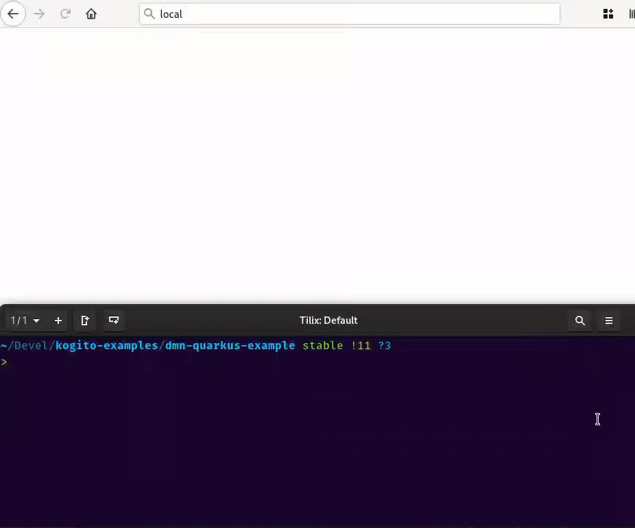

For the last few month, here at [KIE][kie] team we've been hard at work; and that is one of the reasons I haven't written something new for a while. Today I am proud to announce that our **cloud-native business automation platform** is hitting a major milestone. **Today we release [Kogito 1.0][kgt]**! 

[Kogito][kgt] includes best-of-class support for the battle tested engines of
the [KIE][kie] platform: 

- the [Drools][drl] rule language and decision platform, 
- the [jBPM][jbpm] workflow and process automation engine 
- the [OptaPlanner][opt] constraint satisfaction solver

and it brings along new capabilities 
- our fresh new unified [on-line BPMN and DMN editors](https://kiegroup.github.io/kogito-online/#/) and [VSCode-based extension](https://marketplace.visualstudio.com/items?itemName=kie-group.vscode-extension-kogito-bundle)
- noSQL persistence through the Infinispan and the MongoDB addons
- GraphQL status queries
- microservice-based data indexing and timer management
- completely revisited UIs for task and process state 
- CloudEvent for event handling
- the new vendor-neutral [Serverless Workflow Specification](sws)
- business-relevant insights on machine-assisted decisions through the contributions of the [TrustyAI](tai) initiative
- automated deployment through the [Kogito Operator][kop] and the [`kogito` CLI][kli]

I believe there is a lot to be proud of, but I want to talk more about another of the things that make Kogito special, and that is the **heavy reliance on code-generation**. 

In Kogito code-generation has a double purpose: 
1. we generate code ahead-of-time to avoid run-time reflection; 
2. we automatically generate domain-specific services from user-provided knowledge assets.

Together, [Kogito][kgt] delivers a truly **low-code** platform for the design and implementation of knowledge-oriented REST services. 

## Ahead-of-Time Code-Generation

In [Kogito][kgt], we move **parsing, analysis and loading** of knowledge assets such as rules, decisions or workflow definitions to your **build-time**. This way, your application starts faster and it consumes less memory.

While we do support [Spring Boot][spb] (because, hey, we realize you can't really ignore a 800-pound gorilla) we chose [Quarkus][qks] as our primary target runtime, because through its extension system, it lets us truly **embrace ahead-of-time code generation**; and through its simplified support to native image generation, it lets us go even further, producing the **tiniest native executables**. So tiny and cute, they are the envy of a [gopher](https://blog.golang.org/gopher).

Traditionally, when people think of Java, their mind goes to large, fat Application Servers, considerable memory footprint, and boring enterprise software stacks. These are some of the reasons why some people flocked to newer, fancier language runtimes and frameworks. The **Cloud**, albeit allegedly being just "someone else's computer", today is a reality. More and more businesses are using cloud platforms to deploy and run their services. And consequently, because they are paying for the resources they use, they are caring more and more about them.

This is why *application density* is becoming increasingly more important: we want to fit more application instances on the same host, because we want to keep costs low. If your application has a huge memory footprint and high CPU requirements, it will cost more.

If you equate the JDK to *state-of-the-art* web application frameworks, you may believe that it is doomed as a platform, and the only solution would be to flock to other language runtimes. The reality is far more nuanced than that. 

Newer JDK service frameworks target **cloud-native deployment** by leveraging ahead-of-time code generation. By moving the costly part of processing to the build-time of an application, the generated executable is much leaner and lighter-weight. The **startup time sinks**, and so does its **memory footprint**. 

## Automated Generation of Services

The [Kogito extension][qex] generates a complete REST service and, with developer mode, it supports live code reload not only for plain text, but even when you are using our newfangled graphic [modeling tools](https://marketplace.visualstudio.com/items?itemName=kie-group.vscode-extension-kogito-bundle).

## Conclusions

- [KIE Live YouTube Channel][kielive]
- [Kogito Website][kgt]
- [KIE Zulip Chat][zlp]
- [Kogito Mailing List][kml]

[kgt]: https://kogito.kie.org
[kie]: http://kie.org
[drl]: http://www.drools.org/
[jbpm]: http://www.jbpm.org/
[opt]: http://www.optaplanner.org/
[sws]: https://serverlessworkflow.io/
[tai]: https://blog.kie.org/2020/06/trusty-ai-introduction.html
[kop]: https://operatorhub.io/operator/kogito-operator 
[kli]: https://github.com/kiegroup/kogito-cloud-operator/blob/master/README.md

[qks]: https://quarkus.io
[spb]: https://spring.io/projects/spring-boot

[kielive]: https://www.youtube.com/playlist?list=PLo3ZScdD9hW4S94iT3ZgOWm8asSHuMDYn
[zlp]: https://kie.zulipchat.com
[kml]: https://groups.google.com/forum/#!msgid/kogito-development/
