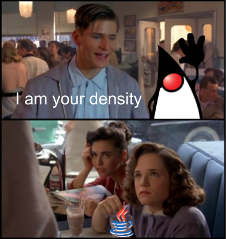

# Kogito 1.0: Build-Time Optimized Business Automation in the Cloud

For the last few months, here at [KIE][kie] team we've been hard at work. Today I am proud to announce that our **cloud-native business automation platform** is hitting a major milestone. **Today we release [Kogito 1.0][kgt]**! 

[Kogito][kgt] includes best-of-class support for the battle-tested engines of
the [KIE][kie] platform: 

- the [Drools][drl] rule language and decision platform, 
- the [jBPM][jbpm] workflow and process automation engine,
- the [OptaPlanner][opt] constraint satisfaction solver;

and it brings along several **new capabilities** 

- our fresh new unified [BPMN](https://bpmn.new) and [DMN editors](https://dmn.new) and [VSCode-based extension](https://marketplace.visualstudio.com/items?itemName=kie-group.vscode-extension-kogito-bundle)
- the new vendor-neutral [Serverless Workflow Specification](sws)
- business-relevant insights on machine-assisted decisions through the contributions of the [TrustyAI](tai) initiative
- automated deployment through the [Kogito Operator][kop] and the [`kogito` CLI][kli]
- noSQL persistence through the Infinispan and the MongoDB addons
- GraphQL as the query language for process data
- microservice-based data indexing and timer management
- completely revisited UIs for task and process state 
- CloudEvent for event handling

## Code Generation

I believe there is a lot to be proud of, but I want to talk more about another thing that makes Kogito special, and that is the **heavy reliance on code-generation**. 

In [Kogito][kgt] code-generation has a **double purpose**: 
1. we generate code ahead-of-time to *avoid run-time reflection*; 
2. we *automatically generate domain-specific services* from user-provided knowledge assets.

Together, [Kogito][kgt] delivers a truly **low-code** platform for the design and implementation of knowledge-oriented REST services. 

## Ahead-of-Time Code-Generation

In [Kogito][kgt], we **load, parse, analyze** your knowledge assets such as rules, decisions or workflow definitions during your **build-time**. This way, your application starts faster and it consumes less memory, and, at run-time, it won't do more than what's necessary.

Compare this to a **more traditional pipeline**, where instead the all the stages of processing of a knowledge asset would occur at run-time:

### Application Density

The **Cloud**, albeit allegedly being «[just someone else's computer](https://shop.spreadshirt.co.uk/chriswatterston/)», is a deployment environment that we have to deal with. More and more businesses are using cloud platforms to deploy and run their services. Thus, because they are paying for the resources they use, they are caring more and more about them.

This is why *application density* is becoming increasingly more important: we want to fit more application instances in the same space, because we want to keep costs low. If your application has a huge memory footprint and high CPU requirements, it will cost you more.

While we do support [Spring Boot][spb] (because, hey, you can't really ignore such a powerhouse), we **chose [Quarkus][qks] as our primary runtime target**, because through its extension system, it lets us truly **embrace ahead-of-time code generation**.

Whichever you choose, be it Spring, or Quarkus, [Kogito][kgt] will move as much processing as possible at build time. But if you want to get the most out of it, we invite you to give [Quarkus][qks] a try: through its simplified support to native image generation, allows Kogito to truly show its potential, producing the **tiniest native executables**. So tiny and cute, they are the envy of a [gopher](https://blog.golang.org/gopher).

[Kogito][kgt] cuts the fat, but you won't lose flavor. And if you pick Quarkus, you'll get **live code reload** for free.

## Automated Generation of Services and Live Reload

Although build-time processing is a characterizing trait of [Kogito][kgt], code-generation is also key to another aspect. We automatically generate a service starting from the knowledge assets that users provide.

### From Knowledge to Service: a Low-Code Platform

You write rules, a DMN decision, a BPMN process or a serverless workflow: in all these cases, in order for these resources to be consumed, you need an API to be provided. In the past, you had full access to the power of our engines, through  a [command-based REST API for remote execution](#insert-url-here) or through their Java programmatic API, when embedding them in a larger application.

While programmatic interaction will always be possible (and we are constantly improving it in Kogito to make it better, with a new API), in Kogito we aim for **low-code**. You drop your business assets in a folder, start the build process, and you get a working service running.

In the animation you see that a single DMN file is translated into an entire fully-functional service, complete with its OpenAPI documentation and UI.

### From Knowledge to Deployed Service: Kogito Operator

Through the [Kogito Operator][kop] you are also able to go from a knowledge asset to a fully-working service in a matter of one click or one command. In this animation you can see the `kogito` cli in action: the operator picks up the knowledge assets, builds a container and deploys it to OpenShift with just 1 command!

### Fast Development Feedback

For local development, the [Kogito Quarkus extension][qex] in developer mode extends Quarkus' native live code reloading capabilities going further from reloading plain-text source code (a feature in Quarkus core) to adding support to hot reload of graphical models supported by our [modeling tools](https://marketplace.visualstudio.com/items?itemName=kie-group.vscode-extension-kogito-bundle). In this animation, for instance you can see hot-reload of a DMN decision table.

In this animation, we update a field of the decision table. As a result, the next time we invoke the decision, the result is different. No rebuild process is necessary, as it is all handled seamlessly by the Kogito extension. You get the feeling of live, run-time processing, but under the hood, Quarkus and Kogito do the heavy lifting of rebuilding, reloading and evaluating the asset. 

### Future Work

In the future we plan to support customization of these automatically-generated services, with a feature we call [**scaffolding**][scf]. With scaffolding you will also be able to customize the code that is being generated. You can already get a sneak peek of this preview feature by [following the instructions in the manual][scf].

## Conclusions

Kogito 1.0 brings a lot of new features, we are excited for reaching this milestone and we can't wait to see what you will build! Reach out for feedback on all our platforms!

- [Kogito Website][kgt]
- [KIE Live YouTube Channel][kielive]
- [KIE Zulip Chat][zlp]
- [Kogito Mailing List][kml]

[kgt]: https://kogito.kie.org
[kie]: http://kie.org
[drl]: http://www.drools.org/
[jbpm]: http://www.jbpm.org/
[opt]: http://www.optaplanner.org/
[sws]: https://serverlessworkflow.io/
[tai]: https://blog.kie.org/2020/06/trusty-ai-introduction.html
[kop]: https://operatorhub.io/operator/kogito-operator 
[kli]: https://github.com/kiegroup/kogito-cloud-operator/blob/master/README.md

[qks]: https://quarkus.io
[spb]: https://spring.io/projects/spring-boot

[scf]: https://docs.jboss.org/kogito/release/latest/html_single/#proc-kogito-creating-project-custom_kogito-creating-running

[kielive]: https://www.youtube.com/playlist?list=PLo3ZScdD9hW4S94iT3ZgOWm8asSHuMDYn
[zlp]: https://kie.zulipchat.com
[kml]: https://groups.google.com/forum/#!msgid/kogito-development/
